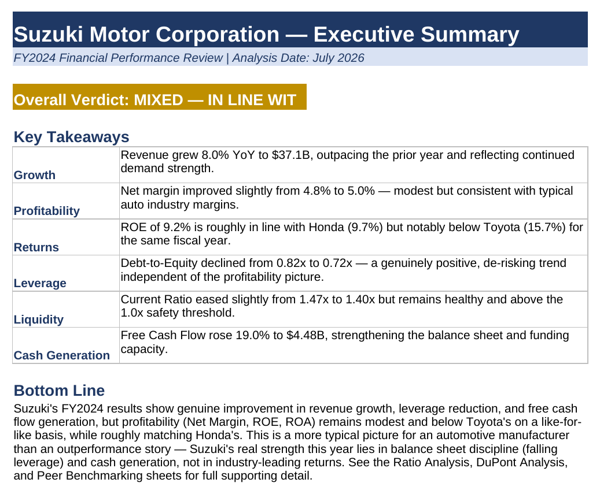
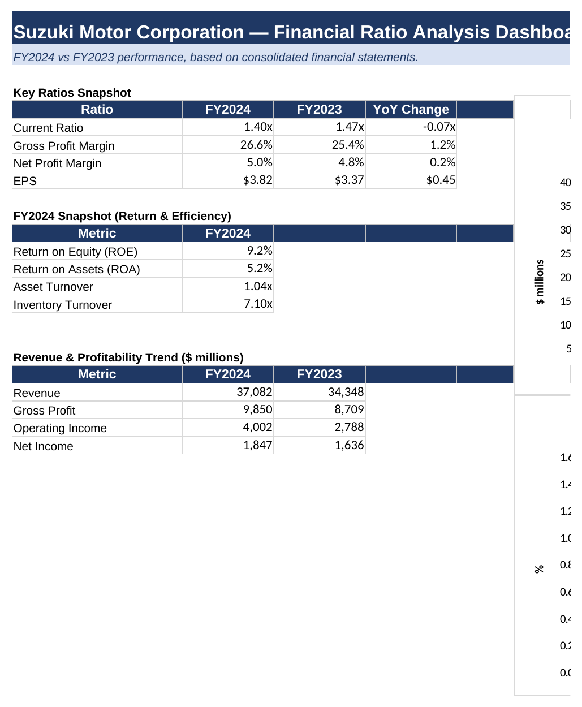
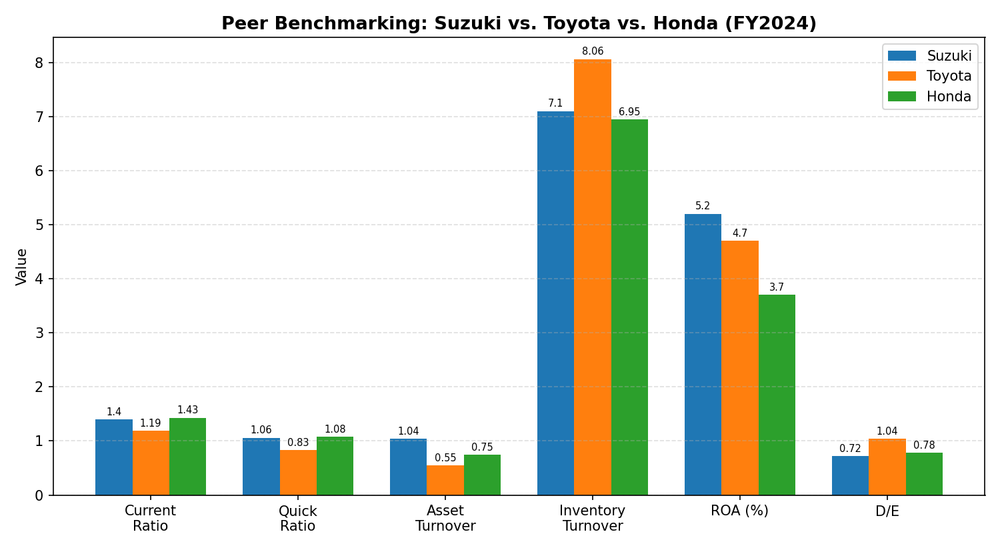
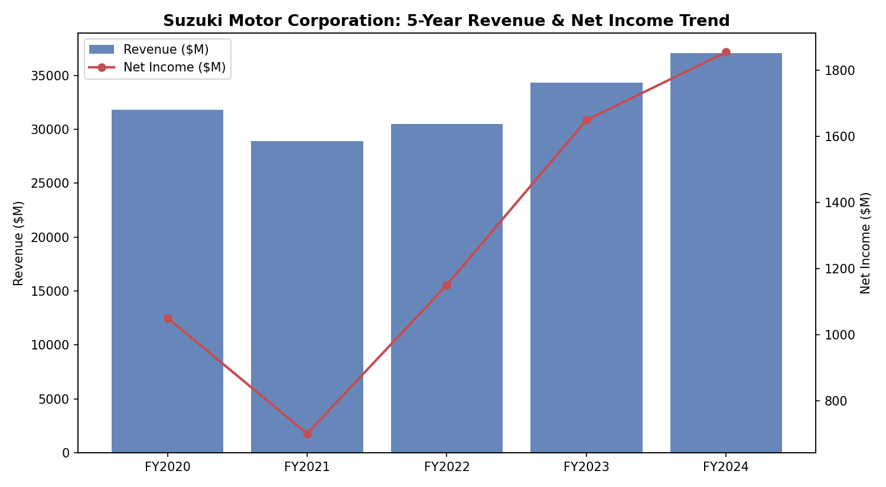

# Suzuki Motor Corporation — Comprehensive Financial Ratio Analysis

**A full financial statement analysis of Suzuki Motor Corporation's FY2020–FY2024 performance, built as a live, formula-driven Excel model spanning liquidity, profitability, leverage, cash flow, DuPont ROE decomposition, and peer benchmarking.**

**Last Updated:** July 2026 *(figures based on Suzuki's most recently available FY2024 consolidated financial statements at time of writing)*

**Contact:** kinzaaftab714@gmail.com

**Project Duration:** ~3 weeks

This project applies institutional-grade financial statement analysis techniques to Suzuki Motor Corporation's consolidated financial statements — going beyond basic ratio calculation to include common-size analysis, a full DuPont decomposition of Return on Equity, a 5-year historical trend, and benchmarking against Toyota and Honda.

## Background

This analysis builds on financial statement research originally conducted during a 6-week industry internship in an automotive dealership's sales department, which motivated a closer look at how a listed automotive manufacturer's financial performance can be evaluated using its public financial statements. Rather than presenting ratios as static figures, this project rebuilds the entire analysis as a **dynamic Excel model** — every figure is calculated via a live formula tracing back to the original financial statement line items, so the workbook stays traceable end to end.

## Preview

## Objectives

- Structure Suzuki Motor Corporation's FY2023–FY2024 financial statements into a clean, analyzable model, extended with a 5-year (FY2020–FY2024) historical view
- Calculate a comprehensive suite of ratios across five categories: liquidity, profitability, leverage, efficiency, and cash flow
- Decompose Return on Equity into its three underlying drivers using **DuPont analysis**
- Perform **common-size (vertical) analysis** to assess the relative weight of each line item
- Extend the analysis with a **verified 5-year revenue and profitability trend** (FY2020–FY2024)
- Benchmark Suzuki's ratios against **Toyota and Honda** for the same fiscal year

## Data Quality & Validation

While building this model, a discrepancy was identified in the original source data: the reported Net Income figure did not reconcile with Earnings Per Share × Shares Outstanding. Cross-checking against independently reported figures confirmed the correct Net Income and allowed the error to be traced and corrected before it could propagate into every downstream ratio (Net Margin, ROE, ROA, DuPont analysis). This correction is documented in the **Notes & Sources** sheet.

This step reflects a core discipline in financial analysis: **verifying data against multiple sources before drawing conclusions**, rather than treating any single source as automatically correct.

## Ratios & Analyses Calculated

| Category | Metric |
|---|---|
| **Liquidity** | Current Ratio, Quick Ratio (Acid-Test) |
| **Profitability** | Gross Profit Margin, Net Profit Margin, Return on Equity, Return on Assets |
| **Leverage** | Debt-to-Equity, Debt-to-Assets, Equity Multiplier |
| **Efficiency** | Asset Turnover, Inventory Turnover |
| **Cash Flow** | Operating Cash Flow Ratio, Cash Flow Margin, Free Cash Flow |
| **Per-Share** | Earnings Per Share (EPS) |
| **Decomposition** | DuPont 3-Step ROE Analysis (Margin × Turnover × Leverage) |
| **Structural** | Common-Size Balance Sheet (% of Total Assets) and Income Statement (% of Revenue) |
| **Historical** | 5-Year Revenue & Net Income Trend (FY2020–FY2024) |
| **Comparative** | Peer Benchmarking vs. Toyota and Honda (7 ratios, FY2024) |

**Note on averaging:** Ratios requiring average balances (ROE, ROA, Asset Turnover, Inventory Turnover, Equity Multiplier) are calculated using the average of FY2023 and FY2024 balance sheet figures — standard financial analysis practice.

## Key Findings (FY2024 vs FY2023)

**Revenue growth and cash generation were the standout strengths:**
- Revenue grew **8.0%** YoY, from $34,348.10M to $37,082.30M
- Free Cash Flow increased **19.0%**, from $3,766.5M to $4,483.7M
- Over the 5-year window (FY2020–FY2024), revenue dipped in FY2021 (COVID-19 demand shock) before recovering to a ~4.5% compound annual growth rate

**Profitability improved modestly, in line with typical auto-industry margins:**
- Net Profit Margin rose slightly from **4.8% to 5.0%**
- Gross Profit Margin improved from **25.4% to 26.6%**
- EPS rose from $3.37 to $3.82 (+13.4%)

**Leverage decreased, improving the financial risk profile:**
- Debt-to-Equity fell from **0.82x to 0.72x**
- Debt-to-Assets fell from **45.2% to 41.7%**

**Liquidity softened slightly but remains healthy:**
- Current Ratio declined from **1.47x to 1.40x**; Quick Ratio from **1.15x to 1.06x**
- Both remain comfortably above 1.0x, indicating no near-term liquidity concern

**DuPont ROE Decomposition (FY2024): ROE = 9.2%**
| Driver | Value |
|---|---|
| Net Profit Margin | 5.0% |
| × Asset Turnover | 1.04x |
| × Equity Multiplier | 1.77x |
| **= ROE** | **9.2%** |

## Peer Benchmarking: Suzuki vs. Toyota vs. Honda (FY2024)

| Ratio | Suzuki | Toyota | Honda | Suzuki vs. Peer Avg |
|---|---|---|---|---|
| Current Ratio | 1.40x | 1.19x | 1.43x | Above |
| Quick Ratio | 1.06x | 0.83x | 1.08x | Above |
| Asset Turnover | 1.04x | 0.55x | 0.75x | Above |
| Inventory Turnover | 7.10x | 8.06x | 6.95x | Below |
| Return on Equity | 9.2% | 15.7% | 9.7% | **Below** |
| Return on Assets | 5.2% | 4.7% | 3.7% | Above |
| Debt-to-Equity | 0.72x | 1.04x | 0.78x | Below (lower leverage) |

**Honest assessment:** Suzuki's ROE (9.2%) trails Toyota's (15.7%) and roughly matches Honda's (9.7%) — this is a more typical result for the sector than an outperformance story. However, Suzuki's **Asset Turnover leads all three peers** (1.04x vs. Toyota's 0.55x and Honda's 0.75x), indicating highly efficient use of its asset base to generate revenue — and it does so with the **lowest leverage of the three**, meaning its returns, while more modest than Toyota's, are achieved with less financial risk.

*Toyota and Honda figures sourced from StockAnalysis.com (FY2024, year ended March 31, 2024); see the Notes & Sources sheet for full methodology and comparability caveats.*

## Tools & Methods

- **Microsoft Excel** — all ratios and decompositions computed via live, linked formulas (not hardcoded values), so correcting one source figure automatically recalculates every downstream ratio, chart, and cross-check throughout the workbook
- Financial statement structuring following standard balance sheet and income statement presentation
- **DuPont analysis** — decomposing ROE into profitability, efficiency, and leverage components
- **Common-size analysis** — standardizing line items as a percentage of Revenue or Total Assets
- **Data validation** — cross-checking reported figures (e.g., Net Income vs. EPS × Shares Outstanding) against independent sources before finalizing conclusions

## Workbook Structure

| Sheet | Purpose |
|---|---|
| **Executive Summary** | One-page verdict and key takeaways for a non-technical reader |
| **Summary Dashboard** | Key ratio snapshot, YoY comparison, and revenue/profitability trend charts |
| **5-Year Trend** | Verified FY2020–FY2024 revenue and net income history with trend chart |
| **Ratio Analysis** | 12 ratios across liquidity, profitability, leverage, efficiency, and cash flow, with interpretations |
| **DuPont Analysis** | 3-step ROE decomposition with cross-check against the direct ROE calculation |
| **Peer Benchmarking** | Suzuki vs. Toyota vs. Honda comparison across 7 key ratios (FY2024), with chart |
| **Common-Size Analysis** | Balance sheet (% of Total Assets) and income statement (% of Revenue) vertical analysis |
| **Balance Sheet** | Source consolidated balance sheet, FY2023–FY2024 |
| **Income Statement** | Source consolidated income statement, FY2023–FY2024 |
| **Cash Flow Statement** | Source consolidated cash flow statement, FY2023–FY2024 |
| **Notes & Sources** | Data sources, methodology notes, and the Net Income correction |

## What This Project Demonstrates

- Ability to structure raw, multi-statement financial data into a fully linked analytical model
- **Data validation discipline** — identifying and correcting a source data error through independent cross-checking, rather than accepting figures at face value
- Application of financial ratio analysis across all major categories used in equity research and credit analysis
- Correct technical handling of **average-balance vs. point-in-time ratios**
- **DuPont decomposition** — isolating whether returns are driven by profitability, efficiency, or leverage
- **Peer benchmarking** — evaluating a company's performance in context, not in isolation
- **Common-size and multi-year trend analysis** — structural and historical techniques used alongside single-period ratios
- Building **fully transparent, formula-driven Excel models** — a core skill in equity research, credit analysis, and corporate finance

## How to Explore This Project

1. Download `Suzuki_Financial_Ratio_Analysis.xlsx` and open it in **Microsoft Excel** (2016 or later recommended for full formula/chart compatibility)
2. Start with the **Executive Summary** sheet for a one-page, non-technical overview
3. Move to the **Summary Dashboard** for key ratios and charts at a glance
4. Explore **Ratio Analysis**, **DuPont Analysis**, **Peer Benchmarking**, and **Common-Size Analysis** sheets for the detailed breakdown
5. Source financial statements (**Balance Sheet**, **Income Statement**, **Cash Flow Statement**) are included for full traceability of every formula
6. Check **Notes & Sources** for methodology, data sources, and the documented Net Income correction
7. No macros are used — the workbook is formula-only, so it opens safely with formulas enabled by default

## Skills & Tools

`Financial Modeling` `Financial Statement Analysis` `DuPont Analysis` `Ratio Analysis` `Common-Size Analysis` `Equity Research` `Credit Analysis` `Microsoft Excel` `Data Validation` `Peer Benchmarking`

## Files

| File | Description |
|---|---|
| `Suzuki_Financial_Ratio_Analysis.xlsx` | Full working Excel model — 11 linked sheets covering executive summary, dashboard, 5-year trend, ratios, DuPont decomposition, peer benchmarking, common-size analysis, and all source financial statements |
| `images/` | Screenshots and charts referenced in the Preview section above |
| `LICENSE` | MIT License covering this project's original content |

## Key Assumptions & Comparability Notes

- All figures are presented in **USD** for consistency; original Suzuki filings are reported in **JPY**. Conversion details and the exchange rate/date used are documented in the **Notes & Sources** sheet
- Peer figures (Toyota, Honda) are sourced from third-party aggregators (StockAnalysis.com); minor differences in accounting treatment or fiscal year-end conventions across companies mean peer comparisons should be read as **directional**, not exact
- All ratios follow standard financial analysis conventions; where a choice existed (e.g., average vs. point-in-time balances), the methodology is noted alongside the relevant ratio

## SWOT Analysis — This Project

### Strengths
- **Data validation discipline** — catching and correcting the Net Income discrepancy elevates this from a textbook exercise to a real-world analytical workflow
- **Multi-technique coverage** — DuPont analysis, common-size analysis, peer benchmarking, and a 5-year trend are all integrated into a single linked model
- **Fully formula-linked Excel build** — no hardcoded values, demonstrating strong technical rigor and easy traceability
- **Honest, balanced conclusions** — Suzuki's weaker ROE versus Toyota is not glossed over, which strengthens the credibility of the analysis

### Weaknesses
- **Scope inconsistency** — the Objectives section references FY2023–FY2024 while the model also incorporates a 5-year (FY2020–FY2024) trend; this could be worded more precisely
- **Repetitive phrasing** — terms like "formula-linked" and "auditable" recur several times across sections
- **Limited peer set** — only two competitors (Toyota, Honda) are benchmarked; a broader peer set would strengthen the comparison
- **No update cadence stated** — there is no indication of when the analysis will be refreshed as new financials are released

### Opportunities
- **Add sensitivity/scenario analysis** — e.g., modeling the margin impact of a change in raw material costs or FX rates
- **Automate data pulls** — pairing the Excel model with a Python or Power Query script for repeatable, auditable updates
- **Build an interactive dashboard** — a Power BI or Tableau companion version would let viewers explore the data live
- **Expand the peer set** — adding Nissan, Mazda, or Hyundai would support a more robust sector-wide comparison

### Threats
- **Data staleness** — without a "last updated" date, the analysis risks appearing outdated once Suzuki releases newer financials
- **Secondary source reliance** — peer data is sourced from StockAnalysis.com and MacroTrends rather than primary filings, which could raise reliability questions if figures are cross-checked
- **Crowded portfolio niche** — financial ratio analysis is a common project type among finance students, so the data-validation angle should be emphasized further to stand out

*Financial statement figures sourced from Suzuki Motor Corporation's publicly available consolidated financial statements. Peer and historical trend data sourced from StockAnalysis.com and MacroTrends. Used for independent educational analysis.*
